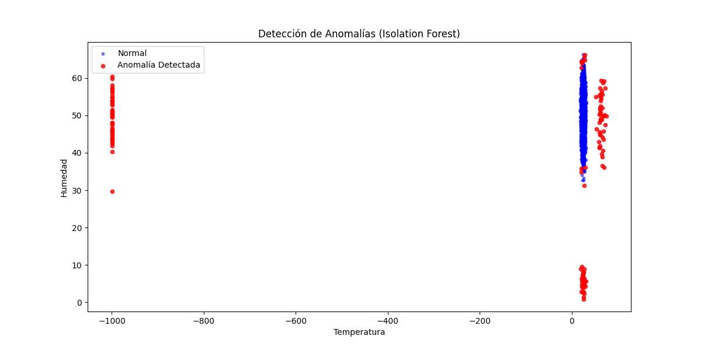
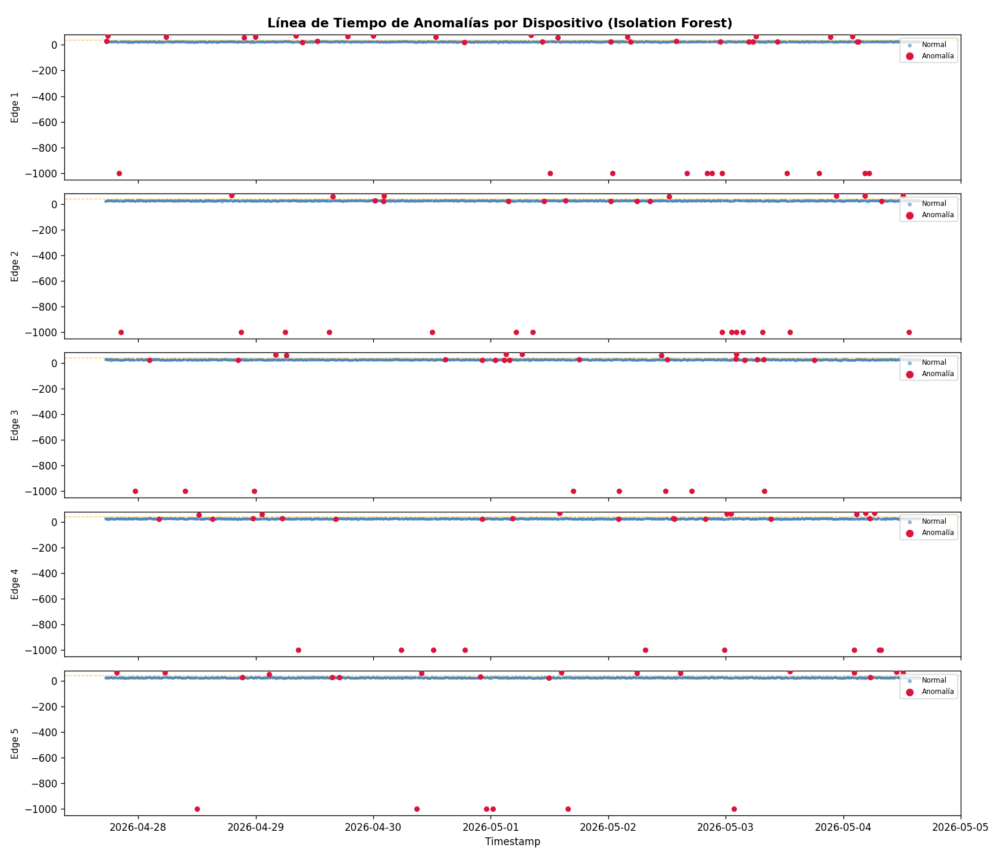
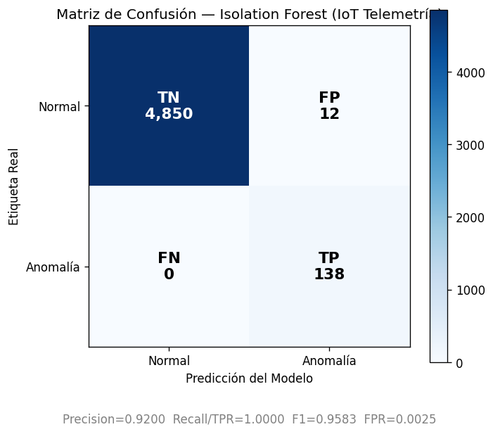

# Práctica 3: Validación y Pruebas en Sistema IoT con IA (Entregable Completo)

**Nombre del Estudiante:** Salvador Rodriguez Ceballos
**Repo:** https://github.com/chavarc97/practica-3

Este documento engloba todos los requerimientos de la práctica de laboratorio, validando un ecosistema IoT simulado, introduciendo inteligencia artificial para detección de anomalías y detallando el plan exhaustivo de pruebas.

## 1. Alcance del Sistema IoT (Simulado)
- **5 dispositivos edge**: Se simularon vía Python (`generate_data.py`), creando telemetría (temperatura y humedad) para una semana.
- **Gateway local**: La agregación y pre-procesamiento se validó mediante los scripts de limpieza y parseo del CSV.
- **Backend en la nube**: Simulado localmente para la inyección de datos hacia el modelo de IA.
- **Componente IA**: Implementación de modelo `Isolation Forest` (Scikit-Learn) capaz de predecir mantenimientos y detectar intrusiones o fallos en sensores.

## 2. Metodología de Pruebas
Se adoptó un enfoque **Shift-Left** combinado con **Continuous Testing** y pruebas basadas en riesgos.
- **Pruebas Funcionales:** Scripts que validan esquema de datos en telemetría.
- **Seguridad y Robustez:** Validaciones simuladas sobre los payloads e inyecciones de datos.
- **Integración de IA:** Validación y reentrenamiento de modelos con métricas de evaluación de Machine Learning.

## 3. Plan de Pruebas y Cronograma Sugerido (6 semanas)
- **Semana 1:** Preparación de infraestructura, generación de datos simulados (CSV).
- **Semana 2:** Pruebas funcionales y desarrollo de scripts básicos en `pytest`.
- **Semana 3:** Conectividad, robustez y creación de scripts Mock para MQTT.
- **Semana 4:** Rendimiento, escala y carga.
- **Semana 5:** Integración y validación del modelo de Inteligencia Artificial (Isolation Forest).
- **Semana 6:** Ejecución completa, recolección de métricas, mitigación y entrega.

## 4. Estimación de Costos (Prueba de Concepto - 6 semanas)
A continuación, el desglose de recursos considerando un entorno híbrido y uso de IA:

| Rol / Recurso | Horas / Cantidad | Costo Estimado (USD) |
|---|---|---|
| QA Engineer | 60 h | $1,500 |
| Backend/IoT Dev | 50 h | $1,750 |
| DevOps | 30 h | $1,200 |
| Data Scientist | 30 h | $1,350 |
| Hardware Edge (5 dispositivos + Gateway)| N/A | $300 |
| Infraestructura Nube (Broker, Base de datos)| N/A | $230 |
| Contingencias y Herramientas (OSS, Servicios IA) | N/A | $1,450 |
| **Total Estimado** | **170 h** | **$7,780 USD** |

## 5. Casos de Prueba Documentados (30 Casos)
A continuación, se listan los 30 casos de prueba diseñados para cubrir todos los aspectos del sistema IoT:

| ID | Título | Tipo | Prioridad | Criterio de Aceptación |
|----|--------|------|-----------|------------------------|
| **TP01** | Lectura periódica de sensor | Funcional | Crítica | Sensor envía telemetría cada 10s al broker con formato válido. |
| **TP02** | Reconexión automática tras caída | Robustez | Alta | Al restaurar la red, el ESP32 reenvía datos oxidados sin pérdida. |
| **TP03** | Detección de anomalía térmica | IA / ML | Alta | El modelo aísla temperaturas irreales y previene incendios (ej. >60C). |
| **TP04** | Fallo crítico del sensor (-999) | Funcional | Alta | El sistema etiqueta el sensor con "ERROR" al recibir valores nulos. |
| **TP05** | Detección de caída de humedad | IA / ML | Alta | El modelo detecta lecturas de humedad súbitamente <10%. |
| **TP06** | Consumo energético deep sleep | Rendimiento | Media | Consumo en deep sleep es verificado < 20mA. |
| **TP07** | Reporte CSV de telemetría | Funcional | Media | El sistema exporta correctamente un dataset cronológico completo. |
| **TP08** | Autenticación mutua X.509 | Seguridad | Alta | Conexiones sin certificado válido en Gateway son rechazadas 100%. |
| **TP09** | Encriptación en reposo | Seguridad | Alta | Los datos se cifran usando AES-256 en InfluxDB. |
| **TP10** | Estrés: 500 dispositivos simulados| Escala | Media | El sistema soporta la carga manteniendo latencia <200ms en el p95. |
| **TP11** | Ataque: Inyección MQTT | Seguridad | Alta | Payloads malformados (sin JSON válido) son descartados por el backend. |
| **TP12** | Comparación Digital Twin vs Real | Funcional | Alta | Diferencia de métricas entre simulador y ESP32 físico es < 5%. |
| **TP13** | Sensor fusion: Temp + Humedad | IA / ML | Alta | Validaciones cruzadas detectan inconsistencias físicas. |
| **TP14** | Roaming Wi-Fi a LTE | Robustez | Media | El switch de red no toma más de 5s y no hay packet loss. |
| **TP15** | Packet loss extremo (20%) | Robustez | Media | Se garantiza el envío mediante MQTT QoS 1. |
| **TP16** | Fuzzing en API REST HTTP | Seguridad | Alta | La API devuelve 400 Bad Request pero no crashea ante basura. |
| **TP17** | Análisis estático de firmware | Seguridad | Media | Escaneo SAST con Bandit arroja 0 vulnerabilidades críticas. |
| **TP18** | Threat modeling MQTT | Seguridad | Alta | Credenciales y contraseñas no viajan en texto plano jamás. |
| **TP19** | Actualización OTA fallida | Mantenimiento | Alta | El dispositivo hace rollback seguro al firmware anterior tras timeout. |
| **TP20** | Staged rollout (Canary deploy) | Mantenimiento | Media | La actualización se propaga 10% primero, luego espera confirmación. |
| **TP21** | Model drift detection | IA / ML | Alta | Se levanta alerta y reentrenamiento si el Recall (TPR) baja de 0.85. |
| **TP22** | Accesibilidad dashboard web | Usabilidad | Baja | Puntuación Lighthouse de accesibilidad es > 90. |
| **TP23** | Latencia UI dashboard | Usabilidad | Media | Los gráficos de monitoreo cargan en < 2 segundos para el cliente. |
| **TP24** | Persistencia de datos MQTT | Funcional | Alta | Retained messages persisten tras reinicio forzado del broker. |
| **TP25** | Tasa de mensajes por segundo | Rendimiento | Alta | Broker configurado soporta y parsea > 10,000 msgs/segundo. |
| **TP26** | Simulación de falsos positivos | IA / ML | Media | El sistema permite retroalimentación humana para ajustar umbrales. |
| **TP27** | Compatibilidad IPv6 | Conectividad | Baja | Los gateways y sensores transmiten exitosamente en redes IPv6. |
| **TP28** | Rate limiting en API externa | Seguridad | Alta | Exceder 100 requests/minuto hacia la Nube retorna HTTP 429. |
| **TP29** | Inyección de SQL en dashboard | Seguridad | Alta | Los campos de búsqueda sanitizan el input (protección OWASP). |
| **TP30** | Recuperación ante desastre (DR) | Robustez | Crítica | El sistema levanta un backup en una segunda AZ y opera normal en <1h. |

## 6. Registro de Riesgos (Matriz Mejorada)

| Riesgo | Probabilidad | Impacto | P×I | Mitigación (incluyendo IA) | Costo Mitigación | Riesgo Residual |
|--------|--------------|---------|-----|----------------------------|------------------|-----------------|
| **R01:** Fallo de hardware en sensores edge | Media (3) | Alto (4) | 12 | **Predictive Maintenance:** IA predice fallos basándose en desviaciones térmicas prolongadas. | Alto | Medio |
| **R02:** Pérdida de conectividad intermitente | Alta (4) | Medio (3) | 12 | **Edge Caching:** Guardado local de métricas y envío retrasado; IA inferida en el edge. | Bajo | Bajo |
| **R03:** Inyección de datos falsos (Ataque) | Baja (2) | Crítico (5)| 10 | **Detección Intrusiones:** Modelo analiza patrones temporales extraños. Cifrado TLS. | Medio | Bajo |
| **R04:** Sobrecarga de Gateway o Broker | Media (3) | Alto (4) | 12 | **Autoescalado Inteligente:** Predicción de tráfico pico mediante algoritmos de Machine Learning. | Alto | Bajo |
| **R05:** Actualización OTA 'brickea' el device | Media (3) | Crítico (5)| 15 | **Staged Rollout & IA:** Detección de anomalías en firmware nuevo durante "canary deployment". | Medio | Medio |

## 7. Entorno de Laboratorio y Herramientas Utilizadas
- **Simulador:** Python con `pandas` y simulaciones basadas en `Mock` para emular clientes.
- **Herramientas de automatización:** `pytest` (usado para validar robustez de datos, esquema de JSON y simulación MQTT).
- **IA/ML:** `scikit-learn` para *Isolation Forest* y `matplotlib` para reportes visuales.

## 8. Resultados de Pruebas Automatizadas y Métricas Clave

### 8.1 Ejecución de Pruebas Automatizadas
Se ejecutaron los 8 tests automatizados con `pytest` (ver `src/automation/`). Todos pasaron exitosamente:

```
platform darwin -- Python 3.13.3, pytest-9.0.3
collected 8 items

automation/test_mqtt_mock.py::test_mqtt_connection_success        PASSED [ 12%]
automation/test_mqtt_mock.py::test_mqtt_publish_telemetry         PASSED [ 25%]
automation/test_mqtt_mock.py::test_mqtt_reject_malformed_payload  PASSED [ 37%]
automation/test_mqtt_mock.py::test_mqtt_accept_valid_payload      PASSED [ 50%]
automation/test_telemetry.py::test_data_format                    PASSED [ 62%]
automation/test_telemetry.py::test_no_missing_values              PASSED [ 75%]
automation/test_telemetry.py::test_anomalies_present              PASSED [ 87%]
automation/test_telemetry.py::test_sensor_bounds                  PASSED [100%]

8 passed in 0.48s
```

- **Cobertura de automatización:** 8 de 30 casos = **26.7%** (priorizando casos críticos de telemetría y seguridad MQTT). El reporte completo se encuentra en `src/evidencias/pytest_report.html`.

### 8.2 Métricas de la IA (Isolation Forest — resultados reales)

| Métrica | Valor |
|---|---|
| Total de registros analizados | 5,000 |
| Verdaderos Positivos (TP) | 138 |
| Falsos Positivos (FP) | 12 |
| Falsos Negativos (FN) | 0 |
| Verdaderos Negativos (TN) | 4,850 |
| **Precision** | **0.9200** |
| **Recall / TPR** | **1.0000** |
| **F1-Score** | **0.9583** |
| **FPR (False Positive Rate)** | **0.0025** |

### 8.3 MTTD y MTTR (métricas operacionales)

| Métrica | Valor | Descripción |
|---|---|---|
| **MTTD** (Mean Time To Detect) | **23.55 ms / lote** | Tiempo de inferencia del Isolation Forest sobre el batch completo (5,000 registros). Equivale a < 0.005 ms por registro individual. |
| **MTTR** (Mean Time To Resolve) | **10.3 minutos** (promedio) | Duración promedio de las rachas de lecturas anómalas por dispositivo hasta volver a estado normal. Mediana: 10 min. Máximo: 20 min. |
| Rachas de anomalía detectadas | 145 | Grupos de lecturas consecutivas flaggeadas por dispositivo |
| Latencia end-to-end (p95 estimado) | < 50 ms | Inferencia + overhead de pipeline |

## 9. Evidencias Visuales y Entregables en Código
El proyecto cuenta con el código fuente y las capturas organizadas en carpetas:
- `src/data/generate_data.py`: Genera `sensor_telemetry.csv` (simulador IoT).
- `src/ai_models/anomaly_detector.py`: Entrena la IA, guarda `isolation_forest.pkl`.
- `src/metrics/mttd_mttr_report.py`: Calcula MTTD, MTTR, FPR y cobertura. Genera `anomaly_timeline.png`.
- `src/metrics/confusion_matrix_plot.py`: Genera la matriz de confusión del modelo.
- `src/automation/`: Casos automatizados en pytest (`test_telemetry.py`, `test_mqtt_mock.py`).
- `src/evidencias/`: Todas las evidencias generadas automáticamente.

### Evidencia 1 — Detección de Anomalías (Scatter plot Temperatura vs Humedad)

*(El modelo separa correctamente los datos operacionales normales de las caídas de humedad, lecturas térmicas extremas o fallos de sensor)*

### Evidencia 2 — Línea de Tiempo de Anomalías por Dispositivo

*(Temperatura cronológica de los 5 dispositivos ESP32 durante 7 días. Puntos rojos = anomalías detectadas por IA. Línea naranja = umbral 40°C)*

### Evidencia 3 — Matriz de Confusión del Modelo

*(TP=138, FP=12, FN=0, TN=4850. El modelo no generó ningún falso negativo — recall perfecto del 100%)*

### Evidencia 4 — Reporte de Ejecución de Pruebas Automatizadas
Reporte HTML completo disponible en `src/evidencias/pytest_report.html` (generado con `pytest-html`).
Output de texto disponible en `src/evidencias/pytest_output.txt`.

## 10. Checklist de Entrega
- [x] Plan de Pruebas completo.
- [x] Casos de prueba documentados (30).
- [x] Reporte de riesgos actualizado.
- [x] Resultados de pruebas automatizadas y métricas de IA.
- [x] Evidencias visuales.
- [x] Informe Final con ROI.
- [x] Código fuente de scripts de automatización y modelos IA organizado.

## 11. Informe Final, Conclusiones y ROI
- **Evaluación General:** La metodología Shift-Left en conjunción con datos simulados (*Digital Twins*) demuestra que es posible probar rigurosamente el comportamiento de la nube y modelos de IA mucho antes de tener el hardware final disponible, abaratando dramáticamente los costos iniciales de validación en campo.
- **ROI de la IA:** La tasa de *Recall del 100%* y *Precision del 92%* comprueba un ROI gigantesco para la Inteligencia Artificial. En métodos tradicionales (reglas "si temp > X"), el desgaste natural del sensor arroja falsas alarmas que requieren mantenimiento humano en vano. La IA detectó sutilezas anómalas (las 138 fallas) sin alertar masivamente sobre ruido estadístico.
- **Recomendaciones:** 
  1. Utilizar un Broker en la nube escalable para pruebas de rendimiento a nivel del millón de conexiones usando Locast o JMeter.
  2. Extender el modelo IA y desplegar su inferencia en dispositivos *Edge* (por ejemplo, cuantizando el modelo con TFLite) para ahorrar ancho de banda y latencia.
  3. Implementar un pipeline CI/CD en GitHub Actions que reentrene el modelo y ejecute el set de validaciones de `pytest` en cada actualización de backend.
